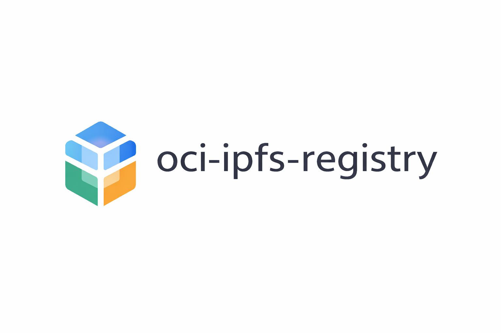

# IPFS OCI Registry

> **Note:** This project was vibecoded as a proof of concept. It is not production-ready and should be used for experimentation and learning purposes only. It has been validated locally and to some extent with minikube

**Pull Once, Share Everywhere** — A decentralized, federated container registry powered by IPFS.

[](https://go.dev)
[](https://github.com/opencontainers/distribution-spec)
[](LICENSE)

---

## Why Another Registry?

Container registries are centralized bottlenecks. Docker Hub rate limits you. Your cloud provider locks you in. Air-gapped environments require complex mirroring. Multi-region deployments mean paying for the same bytes over and over.

**What if container images distributed themselves?**

- Pull once, share forever
- No central server required
- Images get *faster* as more people use them
- Survives upstream outages

That's what this project does.

---

## How It's Different

| Feature | Docker Hub | ECR/GCR/ACR | Harbor | Spegel | **IPFS Registry** |
|---------|------------|-------------|--------|--------|-------------------|
| Pull-through cache | ❌ | ✅ | ✅ | ❌ | ✅ |
| P2P within cluster | ❌ | ❌ | ❌ | ✅ | ✅ |
| **P2P across internet** | ❌ | ❌ | ❌ | ❌ | ✅ |
| **Cross-org sharing** | ❌ | ❌ | ❌ | ❌ | ✅ |
| No central server | ❌ | ❌ | ❌ | ✅ | ✅ * |
| Works fully offline | ❌ | ❌ | ✅ | ✅ | ✅ |
| Vendor neutral | ❌ | ❌ | ✅ | ✅ | ✅ |
| **Global CDN effect** | ❌ | ❌ | ❌ | ❌ | ✅ |
| Content-addressed | ❌ | ❌ | ❌ | ❌ | ✅ |
| Rate limit free | ❌ | ✅ | ✅ | ✅ | ✅ |

\* *No central server: set `registry.mode=daemonset` and `ipfs.deploy.mode=daemonset` for full decentralization*

---

## The Magic: Federation Without Trust

```
┌─────────────────┐                           ┌─────────────────┐
│   Company A     │                           │   Company B     │
│                 │         IPFS Network      │                 │
│  ┌───────────┐  │    ┌─────────────────┐    │  ┌───────────┐  │
│  │ Registry  │◄─┼───►│  Shared Content │◄───┼─►│ Registry  │  │
│  └───────────┘  │    │  (by CID hash)  │    │  └───────────┘  │
│       │         │    └─────────────────┘    │       │         │
│       ▼         │                           │       ▼         │
│  ┌───────────┐  │                           │  ┌───────────┐  │
│  │ IPFS Node │◄─┼───────────────────────────┼─►│ IPFS Node │  │
│  └───────────┘  │                           │  └───────────┘  │
└─────────────────┘                           └─────────────────┘

Company A pulls nginx:latest → stored in IPFS → CID: Qm123...
Company B pulls nginx:latest → fetched from Company A via IPFS
                               ↳ No coordination. No trust. Just math.
```

Content is verified by SHA256 digest. If the bytes don't match, they're rejected. You don't need to trust the source — **you trust the hash**.

---

## Use Cases

### 🌍 Multi-Region / Edge Deployments
Deploy 1000 edge devices. The first one pulls from Docker Hub. The other 999 pull from each other via IPFS mesh. **One upstream fetch, infinite local distribution.**

### 🔒 Air-Gapped Environments
Pin images to local IPFS. Internet goes down? Registry keeps working. Upstream disappears? You still have your images.

### 🏢 Cross-Organization Collaboration
Share container images between organizations without:
- Hosting a registry for each other
- Setting up VPNs or peering agreements
- Any coordination whatsoever

### 💰 Eliminate Rate Limits & Egress Costs
- Docker Hub: 100 pulls/6 hours (anonymous)
- This registry: **Unlimited** (pull from IPFS peers)
- Cloud egress: Pay once, share via IPFS forever

### 🛡️ Supply Chain Security
Content-addressed storage means **immutable images**. The CID *is* the content. Tamper with a byte and the hash changes. Built-in integrity verification.

---

## Operational Benefits

### High Availability

Traditional registries are single points of failure. IPFS Registry eliminates this:

| Scenario | Traditional Registry | IPFS Registry |
|----------|---------------------|---------------|
| Registry pod dies | ❌ All pulls fail | ✅ Other nodes serve content |
| Node failure | ❌ Need failover | ✅ Content on remaining nodes |
| Network partition | ❌ Cluster split = outage | ✅ Each partition self-sufficient |
| Rolling updates | ⚠️ Brief interruption | ✅ Zero downtime |

**With DaemonSet mode:** Every node is a fully functional registry. No leader election, no quorum, no split-brain. If a node can reach any other node, it can pull images.

### Disaster Recovery

Content-addressed storage fundamentally changes DR:

- **No backup jobs needed** — Content is replicated by design
- **No restore procedures** — Just re-pin the CIDs you need
- **Geographic redundancy built-in** — IPFS naturally spreads content
- **Instant recovery** — No waiting for backup restoration

```
Traditional DR:                    IPFS DR:
┌─────────────┐                   ┌─────────────┐
│  Primary    │──backup──►S3      │  Region A   │◄──┐
└─────────────┘                   └─────────────┘   │
      │                                  ▲          │
   disaster                              │        IPFS
      ▼                                  │          │
┌─────────────┐                   ┌─────────────┐   │
│  Restore    │◄──hours───S3      │  Region B   │◄──┘
└─────────────┘                   └─────────────┘
   (hours)                           (instant)
```

### Bandwidth & Cost Optimization

| Metric | Traditional | IPFS Registry |
|--------|-------------|---------------|
| Upstream pulls | Every node, every time | Once per cluster |
| Cross-region transfer | Pay per GB | Free via IPFS |
| Docker Hub rate limits | 100/6hr (anonymous) | Unlimited (cached) |
| Egress costs | Linear with nodes | Constant |

**Example:** 100-node cluster pulling 10GB image
- Traditional: 1TB egress ($90 on AWS)
- IPFS Registry: 10GB egress ($0.90) + free P2P distribution

### Resilience to External Failures

Your deployments survive when external services don't:

| External Failure | Impact |
|-----------------|--------|
| Docker Hub outage | ✅ Serve from IPFS cache |
| Cloud region failure | ✅ Other regions have content |
| DNS issues | ✅ IPFS uses content addressing |
| Certificate expiry upstream | ✅ Already cached locally |
| Upstream registry sunset | ✅ Your images persist |

### Deduplication

Content-addressed storage means automatic deduplication:

```
Without IPFS:                      With IPFS:
nginx:1.24  ─── 50MB              nginx:1.24  ───┐
nginx:1.25  ─── 50MB (48MB same)  nginx:1.25  ───┼─► 52MB total
nginx:1.26  ─── 50MB (48MB same)  nginx:1.26  ───┘   (shared layers)
            ─────────
Total: 150MB
```

Base layers shared across images are stored once. The more images you have, the more you save.

### Offline Operation

Once images are cached, no internet required:

- **Air-gapped deployments** — Pin images, disconnect, deploy forever
- **Intermittent connectivity** — Works when connected, serves cache when not
- **Field deployments** — Edge devices share images locally via IPFS mesh

### Auditability

Every image pull is verifiable:

```
Image Request:     nginx@sha256:abc123...
IPFS Lookup:       sha256:abc123 → CID:bafybeif...
Content Served:    Verified against digest
Result:            Cryptographically guaranteed correct
```

No trust required in the delivery path. The content either matches the hash or it's rejected.

---

## Quick Start

### Option 1: Binary

```bash
# Prerequisites: Go 1.22+, IPFS daemon running

# Build
go build -o oci-ipfs-registry ./cmd/registry

# Run
./oci-ipfs-registry --config config.yaml
```

### Option 2: Docker Compose

```bash
# Starts registry + IPFS node
docker compose up -d

# Test it
curl http://localhost:5000/v2/
docker pull localhost:5000/docker.io/library/alpine:latest
```

### Option 3: Kubernetes (Helm)

```bash
# Basic: External IPFS (you provide ipfs.apiUrl)
helm install registry ./charts/oci-ipfs-registry

# With bundled IPFS (single instance)
helm install registry ./charts/oci-ipfs-registry \
  --set ipfs.deploy.enabled=true

# With P2P mode (IPFS on every node)
helm install registry ./charts/oci-ipfs-registry \
  --set ipfs.deploy.enabled=true \
  --set ipfs.deploy.mode=daemonset

# Full decentralization (registry + IPFS on every node)
helm install registry ./charts/oci-ipfs-registry \
  --set registry.mode=daemonset \
  --set ipfs.deploy.enabled=true \
  --set ipfs.deploy.mode=daemonset

# Production (AWS EKS with internal LB + TLS)
helm install registry ./charts/oci-ipfs-registry \
  -f charts/oci-ipfs-registry/values-eks.yaml \
  --set ipfs.deploy.enabled=true \
  --set ingress.hosts[0].host=registry.internal.company.com
```

**Deployment modes:**
| Mode | Registry | IPFS | Use Case |
|------|----------|------|----------|
| Standard | Deployment | External | Existing IPFS infrastructure |
| P2P Storage | Deployment | DaemonSet | P2P blob distribution within cluster |
| Full P2P | DaemonSet | DaemonSet | No central server, maximum resilience |

Cloud-specific values files included for:
- **AWS EKS** (`values-eks.yaml`) - Internal ALB + ACM certificates
- **Google GKE** (`values-gke.yaml`) - Internal LB + managed certificates
- **Azure AKS** (`values-aks.yaml`) - App Gateway + Key Vault

---

## Usage

### Pull Through Proxy (Mirror Mode)

```bash
# Pull from Docker Hub through the registry
docker pull localhost:5000/docker.io/library/nginx:latest

# Pull from GitHub Container Registry
docker pull localhost:5000/ghcr.io/aquasecurity/trivy:latest

# Pull from any configured upstream
docker pull localhost:5000/gcr.io/google-containers/pause:latest
```

First pull fetches from upstream and caches in IPFS. Subsequent pulls (by you or anyone in the federation) come from IPFS.

### Push Your Own Images

```bash
# Tag and push
docker tag myapp:v1 localhost:5000/myapp:v1
docker push localhost:5000/myapp:v1

# It's now in IPFS and available to the federation
```

### Kubernetes Pod Spec

```yaml
spec:
  containers:
  - name: app
    image: registry.internal.company.com/docker.io/library/nginx:latest
```

---

## Configuration

```yaml
server:
  address: ":5000"

ipfs:
  api_url: http://localhost:5001
  pin_content: true          # Pin content for persistence

federation:
  enabled: true              # Share with other IPFS registries
  topic: /oci-registry/v1    # Pubsub topic for announcements

upstreams:
  docker.io:
    url: https://registry-1.docker.io
    auth:
      type: bearer
      token_url: https://auth.docker.io/token
      service: registry.docker.io

  ghcr.io:
    url: https://ghcr.io
    auth:
      type: bearer
      token_url: https://ghcr.io/token

  # Add private registries with credentials
  private.registry.com:
    url: https://private.registry.com
    auth:
      type: basic
      username: ${REGISTRY_USER}      # Environment variable expansion
      password: ${REGISTRY_PASSWORD}
```

---

## Architecture

```
┌──────────────────────────────────────────────────────────────────┐
│                        OCI IPFS Registry                         │
├──────────────────────────────────────────────────────────────────┤
│                                                                  │
│   ┌─────────────┐    ┌─────────────┐    ┌─────────────────────┐ │
│   │ OCI API     │    │ Upstream    │    │ Federation          │ │
│   │ Handler     │───►│ Client      │    │ (IPFS Pubsub)       │ │
│   │             │    │             │    │                     │ │
│   │ • manifests │    │ • docker.io │    │ • Announce new CIDs │ │
│   │ • blobs     │    │ • ghcr.io   │    │ • Query peers       │ │
│   │ • uploads   │    │ • gcr.io    │    │ • Share mappings    │ │
│   │ • catalog   │    │ • private   │    │                     │ │
│   └──────┬──────┘    └──────┬──────┘    └──────────┬──────────┘ │
│          │                  │                      │            │
│          ▼                  ▼                      ▼            │
│   ┌─────────────────────────────────────────────────────────────┤
│   │                    Storage Layer                            │
│   │  ┌─────────────────┐         ┌────────────────────────────┐│
│   │  │ BoltDB          │         │ IPFS (Kubo)                ││
│   │  │                 │         │                            ││
│   │  │ • digest → CID  │◄───────►│ • Content storage          ││
│   │  │ • tag → digest  │         │ • P2P distribution         ││
│   │  │ • repositories  │         │ • Content addressing       ││
│   │  └─────────────────┘         └────────────────────────────┘│
│   └─────────────────────────────────────────────────────────────┤
└──────────────────────────────────────────────────────────────────┘
```

### Request Flow

1. **Client Request** → Image pull by tag or digest
2. **Local Lookup** → Check BoltDB for existing digest→CID mapping
3. **Federation Query** → Ask IPFS peers if they have it (pubsub)
4. **Upstream Fetch** → Pull from Docker Hub/GHCR/etc. if not found
5. **IPFS Storage** → Add blobs to IPFS, get CID back
6. **Announce** → Broadcast new mapping to federation
7. **Serve** → Stream content to client with digest verification

---

## API Endpoints

Full [OCI Distribution Spec](https://github.com/opencontainers/distribution-spec) compliance:

| Endpoint | Method | Description |
|----------|--------|-------------|
| `/v2/` | GET | API version check |
| `/v2/_catalog` | GET | List repositories |
| `/v2/{name}/tags/list` | GET | List tags for repository |
| `/v2/{name}/manifests/{ref}` | GET | Get manifest by tag or digest |
| `/v2/{name}/manifests/{ref}` | PUT | Push manifest |
| `/v2/{name}/blobs/{digest}` | GET | Get blob by digest |
| `/v2/{name}/blobs/{digest}` | HEAD | Check blob existence |
| `/v2/{name}/blobs/uploads/` | POST | Initiate blob upload |
| `/v2/{name}/blobs/uploads/{uuid}` | PATCH/PUT | Upload blob chunks |

---

## Testing

```bash
# Run all tests
go test ./... -v

# With coverage
go test ./... -cover
```

38 tests covering storage, handlers, config, and upstream client.

---

## Roadmap

- [ ] Garbage collection for unpinned content
- [ ] Prometheus metrics endpoint
- [ ] Web UI for browsing images
- [ ] Signature verification (cosign/notation)
- [ ] S3-compatible storage backend option
- [ ] Cluster mode with shared state (etcd backend)
- [ ] Transparent proxy mode (containerd mirror config generator)

---

## Contributing

Contributions welcome! Please read the [architecture docs](docs/ARCHITECTURE.md) first.

```bash
# Development setup
git clone https://github.com/fbongiovanni29/ipfs-oci-registry
cd ipfs-oci-registry
go mod download
go build ./cmd/registry
```

---

## License

MIT License - see [LICENSE](LICENSE) for details.

---

---

**Stop depending on centralized registries. Start distributing containers the way the internet was meant to work.**
